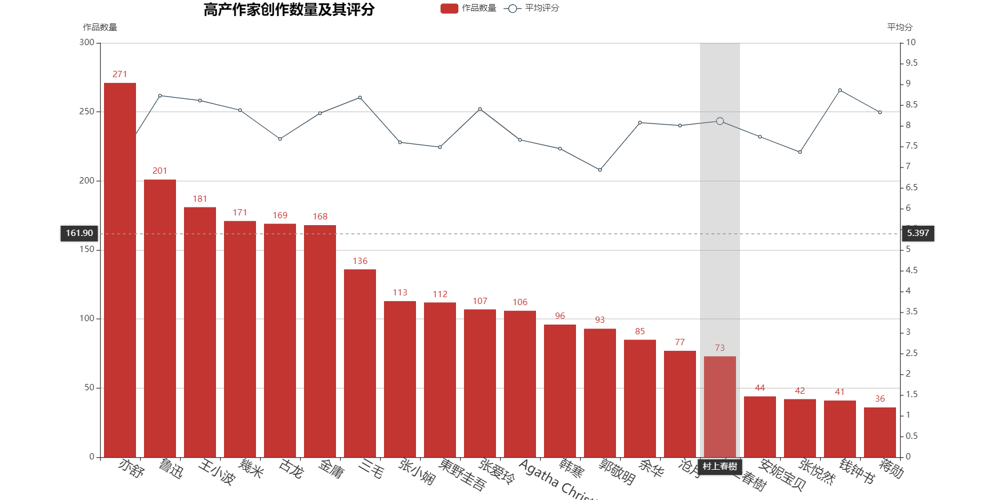
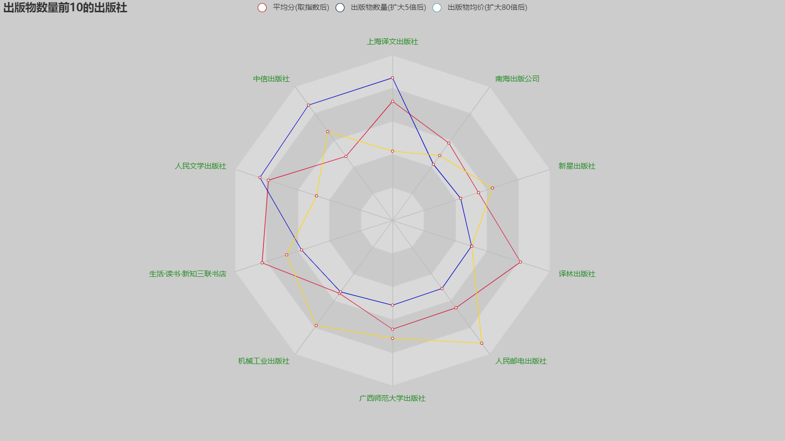
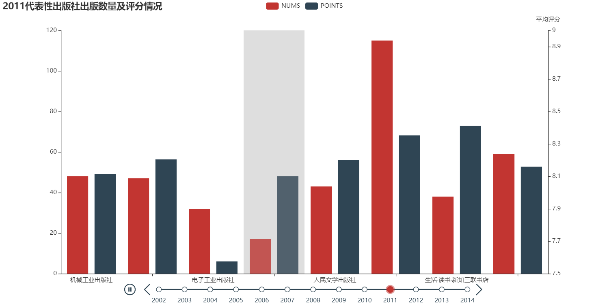

# Python数据分析与可视化实践 
> 班级：岩土jd1901 姓名：张逸敏 学号：0121906280724 完成日期：2020/5/9

<!-- @import "[TOC]" {cmd="toc" depthFrom=1 depthTo=6 orderedList=false} -->

<!-- code_chunk_output -->

- [Python数据分析与可视化实践](#python数据分析与可视化实践)
  - [前言](#前言)
    - [研究对象](#研究对象)
    - [研究方式](#研究方式)
    - [研究意义](#研究意义)
    - [图表种类](#图表种类)
    - [数据来源](#数据来源)
  - [程序分析与设计(有些注释太长，详见源代码)](#程序分析与设计有些注释太长详见源代码)
    - [导入库](#导入库)
    - [函数设计](#函数设计)
      - [合并多个excel文件，最后写入一个txt文件中](#合并多个excel文件最后写入一个txt文件中)
      - [数据清洗](#数据清洗)
      - [生成DataFrame](#生成dataframe)
      - [币值转换，原始数据中的价格是字符串形式，包含货币标记和数值](#币值转换原始数据中的价格是字符串形式包含货币标记和数值)
      - [生成高产作家前20的相关信息](#生成高产作家前20的相关信息)
      - [生成代表性出版社的相关信息](#生成代表性出版社的相关信息)
      - [生成高产出版社前10的相关信息](#生成高产出版社前10的相关信息)
      - [绘制图表](#绘制图表)
        - [柱状图和折线图](#柱状图和折线图)
        - [时间线饼图](#时间线饼图)
        - [时间线柱状图](#时间线柱状图)
        - [雷达图](#雷达图)
        - [漏斗图](#漏斗图)
      - [main函数](#main函数)
    - [主程序](#主程序)
  - [可视化结果展示及分析](#可视化结果展示及分析)
    - [柱状图和折线图](#柱状图和折线图-1)
    - [漏斗图](#漏斗图-1)
    - [雷达图](#雷达图-1)
    - [时间线饼图和时间线柱状图](#时间线饼图和时间线柱状图)
  - [待改善之处](#待改善之处)

<!-- /code_chunk_output -->

## 前言
“得半日之闲，可抵十年尘梦”一卷书，一壶茶，御六气，游无穷。自古以来，我国便有喜爱读书的传统

### 研究对象  
    书籍、作家和出版社

### 研究方式  
    原始数据是多个excel表格形式，首先将其合并为一个csv格式的文件，再生成DataFrame格式的数据，主要利用pandas中的groupby进行分组分析

### 研究意义
    近年来，在全球信息化的浪潮下，图书种类纷繁复杂，各种书籍良莠不齐。因此，对现在市面上的图书进行数据分析，了解各个作家和出版社的水平，是多而杂，还是少而精，亦或是既保证数量又保证质量，是具有实际意义的
### 图表种类  
    - 漏斗图：各价格区间的书籍数量
    - 柱状图和折线图：高产作家前20的作品数量和平均评分
    - 雷达图：高产出版社前10的平均评分、出版数量、平均价格
    - 柱状图（时间轴）：文学领域和科技领域具有代表性的出版社每年的出版数量和平均评分
    - 饼图（时间轴）：具有代表性的出版社每年出版数量*更加直观*的展示  

### 数据来源  
    https://gitee.com/reference/doubanbook30000.git

## 程序分析与设计(有些注释太长，详见源代码)

### 导入库
```python
import os
from tqdm import tqdm
import pandas as pd
import re
import math
import pyecharts.options as opts
from pyecharts.charts import Bar, Line, Radar, Pie, Timeline, Funnel
```
> os：用于读取excel文件  
tqdm：用于生成进度条效果，增加用户体验  
pandas：数据处理  
re：匹配数据中的关键信息并提取  
math：用指数函数扩大数据间的差异  
pyecharts：用于数据可视化

### 函数设计

#### 合并多个excel文件，最后写入一个txt文件中
```python
def MergeFiles() -> list:
    '''
    合并多个excel文件，最后写入一个txt文件中\n
    :return: 每个元素是csv格式文件每一行切分过后的列表的列表
    '''
    dir = "./RawData"  # 设置工作路径
    frames = []  # 每个文件读成一个dataframe，存到frames列表中
    for root, dirs, files in os.walk(dir):
        for file in tqdm(files):
            df = pd.read_excel(os.path.join(root, file))  # excel转换成DataFrame
            frames.append(df)
    result = pd.concat(frames) # 合并所有数据
    # 删除无用的列
    del result['图片地址']
    del result['URL入口']
    # 删除包含缺失值的行
    result_cleaned = result.dropna()
    result_cleaned = result_cleaned.drop_duplicates()
    # 用'{'分隔，因为数据里本来就存在逗号，如 "阿宅, 你已經死了!"的形式(双引号里有逗号)
    if not os.path.exists("./HandledData/merged.txt"):
        result_cleaned.to_csv('./HandledData/merged.txt', sep='{', index=False)
    # 读合并过后的txt文件，生成列表，每个元素是每一行切分过后的列表，
    with open("./HandledData/merged.txt", encoding='utf-8') as file:
        file.readline()  # 让文件的指针指向第二行，把列名跳过，后续再定义
        ls = [line.strip().split('{') for line in file]
    print("Successfully ran MergeFiles")
    return ls
```

#### 数据清洗  
```python
def DataClean(ls: list) -> list:
    '''
    清除无效数据：书名、出版信息、评价星数三者不全的;出版信息不全的;正则匹配不到年份的;正则匹配不到价格的\n
    :param ls: 原列表，存放原始数据
    :return: new_ls
    '''
    new_ls = []
    yearRegex = re.compile(r'(2|1)\d{3}')  # 正则表达式匹配年份,待匹配字符串的格式有"y-m-d"、"m-d-y",甚至还有July 16, 2005
    priceRegex = re.compile(r'\d+(\.\d+)?')  # 正则表达式匹配价格,待匹配格式：19.50元， USD 10.99等
    for idx in tqdm(range(len(ls))):
        if len(ls[idx]) == 3 and len(ls[idx][1].split('/')) >= 4 and \
                yearRegex.search(ls[idx][1].split('/')[-2].strip()) and \
                priceRegex.search(ls[idx][1].split('/')[-1].strip()):
            new_ls.append(ls[idx])

    print("Successfully ran DataClean")
    return new_ls
```

#### 生成DataFrame
```python
def GenerateListAndDf(new_ls: list) -> pd.DataFrame:
    '''
    生成书名、作者、出版日期、价格、评价星数的列表，以生成DataFrame\n
    :param new_ls: txt文件每一行切分后的列表
    :return: 列名是'title','author','time','price','points'的DataFrame
    '''
    yearRegex = re.compile(r'(2|1)\d{3}')  # 正则表达式匹配年份,待匹配字符串的格式有"y-m-d"、"m-d-y",甚至还有July 16, 2005
    author = [x[1].split('/')[0].strip() for x in tqdm(new_ls)]
    price = [x[1].split('/')[-1].strip() for x in tqdm(new_ls)]
    time = [int(yearRegex.search(x[1].split('/')[-2].strip()).group()) for x in tqdm(new_ls)]  # 出版日期只取到年份
    title = [x[0].strip() for x in tqdm(new_ls)]
    points = [float(x[2]) for x in tqdm(new_ls)]
    publisher = [x[1].split('/')[-3].strip() for x in tqdm(new_ls)]
    price = ConvertMoney(price)
    names = ['title', 'author', 'publisher', 'time', 'price', 'points']
    dic = dict(zip(names, [title, author, publisher, time, price, points]))
    Data = pd.DataFrame(dic)
    Data = Data.dropna()
    print("Successfully ran GenerateListAndDf")
    return Data
```

#### 币值转换，原始数据中的价格是字符串形式，包含货币标记和数值
    > 首先利用正则表达式提取货币标记，集合去重后打印，人工筛选标记，如"￥"和'RMB'代表的是同一种货币
```python
def ConvertMoney(price: list) -> list:
    '''
    将价格都换算成人民币为单位的\n
    :param price: 每个元素是一个字符串的列表
    :return: 每个元素是浮点数的列表
    '''
    priceRegex = re.compile(r'\d+(,\d+)*\.?\d*')  # 注意这里可能有三位分节法表示的数字
    markRegex = re.compile((r'[^\d]+'))  # # 匹配价格中代表货币种类的部分
    JapanList = ['税', '込', '円', '日', 'JP', 'NNT', 'Yen']  # 1日元=0.06632人民币
    TaiWanList = ['N.T.', 'NT', 'NTD', 'TWD', '台', '臺', 'N.T', 'nt']  # 1新台币=0.2370人民币
    SouthKoreaList = ['韩', 'KRW']  # 1韩元=0.005799人民币
    HKList = ['HK', '港', 'hk', 'H.K.']  # 1港元=0.9125人民币
    UKList = ['£', 'UK', 'uk', 'GBP']  # 1英镑=8.7757人民币
    EuropeList = ['EUROS', '€', 'EUR']  # 1欧元=7.6673人民币
    SingaporeList = ['新元']  # 1新加坡元=5.0076人民币
    ThailandList = ['THB', 'baht']  # 1泰铢=0.2196人民币
    MalaysiaList = ['RM']  # 1马来西亚林吉特=1.6335人民币
    CanadaList = ['CAD', 'CAN', 'CDN']  # 1加元=5.0771人民币
    USList = ['us', 'US', '美', '$']  # 1美元=7.0732人民币
    for i in tqdm(range(len(price))):
        match_mark = markRegex.search(price[i])  # 匹配价格中代表货币种类的部分
        match_value = priceRegex.search(price[i])  # 匹配价格的数值部分
        if match_mark and match_value:  # 事实上，match_value是恒为True的,它价格总不能没有阿拉伯数字而用文字表达吧
            mark = match_mark.group()
            value = float(match_value.group().replace(',', ''))  # 将匹配到的数值字符串中的','删除,再转为浮点型
            if any(x in mark for x in JapanList):
                value *= 0.06632
            elif any(x in mark for x in TaiWanList):
                value *= 0.2370
            elif any(x in mark for x in SouthKoreaList):
                value *= 0.005799
            elif any(x in mark for x in HKList):
                value *= 0.9125
            elif any(x in mark for x in UKList):
                value *= 8.7757
            elif any(x in mark for x in EuropeList):
                value *= 7.6673
            elif any(x in mark for x in SingaporeList):
                value *= 5.0076
            elif any(x in mark for x in ThailandList):
                value *= 0.2196
            elif any (x in mark for x in MalaysiaList):
                value *= 1.6335
            elif any(x in mark for x in CanadaList):
                value *= 5.0771
            elif any(x in mark for x in USList):  # 倒数第二个换算美元，因为"$"在上述的币种中也存在,"$"单独存在时表示美元
                value *= 7.0732
            else:
                value = value
        elif match_value:
            value = value
        price[i] = value
    print("Successfully ran ConvertMoney")
    return price
```

#### 生成高产作家前20的相关信息
    > 作家名称、作品数量、作品均分的列表
```python
def RankOfCompositionNums(Data: pd.DataFrame) -> tuple:
    '''
    作品数量top20的作家\n
    :param Data: DataFrame
    :return: top20作家名称、作品数量、作品均分三个列表组成的元组
    '''
    # 作品数量前20的作家名称，因为简体繁体等原因，有重复，所以取前30，后续删除重复
    Top20WritersNames = Data.groupby('author').title.count().sort_values(ascending=False).index.to_list()[:30]
    del Top20WritersNames[27:29]
    del Top20WritersNames[23:25]
    del Top20WritersNames[16:22]
    # 作品数量top20的作家的作品数量
    Top20WritersNums = Data.groupby('author').title.count().sort_values(ascending=False).to_list()[:30]
    del Top20WritersNums[27:29]
    del Top20WritersNums[23:25]
    del Top20WritersNums[16:22]
    AvgPoints = Data.groupby('author').points.mean().to_dict()
    Top20WritersPoints = [AvgPoints[x] for x in tqdm(Top20WritersNames)]
    print("Successfully ran RankOfCompositionNums")
    return Top20WritersNames, Top20WritersNums, Top20WritersPoints
```

#### 生成代表性出版社的相关信息
    > 各年份各出版社的评分、出版量及当年总出版量
```python
def DictOfDicts(Data: pd.DataFrame) -> tuple:
    '''注释太多，详见源代码'''
    dic_1 = {}
    publishers = ['机械工业出版社', '人民邮电出版社', '电子工业出版社', '清华大学出版社', '人民文学出版社', '上海译文出版社','生活·读书·新知三联书店', '广西师范大学出版社']
    grouped_1 = Data.groupby('time')
    grouped_2 = Data.groupby(['time', 'publisher'])  # 根据两个列——出版年份和出版社——分组
    value = grouped_1.title.count().to_list()  # 各个年份总出版量的列表，只有数据，按照年份从早到晚的顺序
    key = grouped_1.title.count().index.to_list()  # 各个年份的列表
    dic_2 = dict(zip(key, value))  # 生成年份和出版数量对应的字典
    # dic_1是字典的嵌套,第一层:  年份:字典
    #                第二层:   出版社:列表(列表内包含该年该出版社出版的作品数量和平均分)
    for (year, pub), group in tqdm(grouped_2):  # 遍历根据多个列分组的GroupBy对象,(year, pub)是分组的列名的元组,group是这个组里的dataframe
        if year not in dic_1:
            dic_1[year] = {}
        AvgPoints = group.points.mean()
        BookNum = group.title.count()
        dic_1[year][pub] = [AvgPoints, BookNum]
    data_points = {}
    data_nums = {}
    data_all_published = {}
    for year in tqdm(range(2002, 2015)):
        data_points[year] = [dic_1[year][name][0] for name in publishers]
        data_nums[year] = [dic_1[year][name][1] for name in publishers]
        data_all_published[year] = dic_2[year]
    # <class 'numpy.int32'>  data_nums的每一个值是一个列表，列表里的元素是numpy的数据类型，转成python的int类型
    for k in tqdm(data_nums.keys()):
        data_nums[k] = [int(x) for x in data_nums[k]]
    print("Successfully ran DictOfDicts")
    return data_points, data_nums, data_all_published
```

#### 生成高产出版社前10的相关信息
    > 出版物数量前10的出版社的评分、数量和价格排名
```python
def RankOfPublisher(Data: pd.DataFrame) -> tuple:
    '''
    出版物数量前10的出版社的评分、数量和价格排名\n
    :param Data: DataFrame
    :return: tuple of five lists
    '''
    NamesOfPubs = Data.groupby('publisher').title.count().sort_values(ascending=False).index.to_list()[:10]
    BookNumsOfPubs = Data.groupby('publisher').title.count().sort_values(ascending=False).to_list()[:10]
    AvgPointsOfAll = Data.groupby('publisher').points.mean().to_dict()
    PriceOfAllPubs = Data.groupby('publisher').price.mean()
    AvgPoints = [AvgPointsOfAll[x] for x in NamesOfPubs]
    AvgPrice = [float(PriceOfAllPubs[x]) for x in NamesOfPubs]
    PriceOfAllBooks = [float(x) for x in tqdm(Data.price.to_list())]  # 浮点数列表，包含每一本书的价格
    print("Successfully ran RankOfPublishers")
    return BookNumsOfPubs, NamesOfPubs, AvgPoints, AvgPrice, PriceOfAllBooks
```

#### 绘制图表
    > 绘制信息见前言部分

##### 柱状图和折线图
```python
def BarAndLine(Top20WritersNames: list, Top20WritersNums: list, Top20WritersPoints: list):
    '''
    高产作家(productive author)创作数量及其评分\n
    :param Top20WritersNames: 高产作者前20名称的列表
    :param Top20WritersNums: 高产作者前20各自的作品数量的列表
    :param Top20WritersPoints: 高产作者前20的作品评分的列表
    :return: 没有
    '''
    global dir_to_save
    x_data = Top20WritersNames
    bar = (
        Bar(init_opts=opts.InitOpts(width="1000px", height="500px"))  # 指定图片大小
            .add_xaxis(xaxis_data=x_data)
            .add_yaxis(series_name="作品数量", yaxis_data=Top20WritersNums, )
            .extend_axis(
            yaxis=opts.AxisOpts(
                name="平均分",
                type_="value",  # 数值轴。还有“time”、“category”等选项，试了试发现画出来的图很奇怪，不深究了
                min_=0,
                max_=10,
                interval=0.5,
                # axislabel_opts=opts.LabelOpts(formatter="{value}"), y轴刻度需要单位时设置，此时为评价分数，不用单位
            )
        )
            .set_global_opts(
            tooltip_opts=opts.TooltipOpts(
                is_show=True, trigger="axis", axis_pointer_type="cross"
            ),
            xaxis_opts=opts.AxisOpts(
                type_="category",
                axispointer_opts=opts.AxisPointerOpts(is_show=True, type_="shadow"),
                axislabel_opts=opts.LabelOpts(rotate=-30, font_size=18)  # x轴标签旋转，设置字体大小
            ),
            yaxis_opts=opts.AxisOpts(
                name="作品数量",
                type_="value",
                min_=0,
                max_=300,
                interval=50,
                axislabel_opts=opts.LabelOpts(formatter="{value}"),
                axistick_opts=opts.AxisTickOpts(is_show=True),
                splitline_opts=opts.SplitLineOpts(is_show=True),
            ),
            title_opts=opts.TitleOpts(title='高产作家创作数量及其评分'
                                      , pos_left='8%'  # 标题的位置 距离左边20%距离。
                                      , title_textstyle_opts=opts.TextStyleOpts(color='black'
                                                                                , font_size=20
                                                                                , font_weight='bold'
                                                                                )  # 大标题文字的格式配置
                                      )
        )
    )
    line = (
        Line()
            .add_xaxis(xaxis_data=x_data)
            .add_yaxis(
            series_name="平均评分",
            yaxis_index=1,
            y_axis=Top20WritersPoints,
            label_opts=opts.LabelOpts(is_show=False),
        )
    )
    bar.overlap(line).render(dir_to_save + "ProductiveAuthor_bar_and_line.html")
    print("Successfully drew ProductiveAuthor_bar_and_line")
```
##### 时间线饼图  
```python
def TimelinePie(data_nums: dict):
    global dir_to_save
    attr = ['机械工业出版社', '人民邮电出版社', '电子工业出版社',
            '清华大学出版社', '人民文学出版社', '上海译文出版社',
            '生活·读书·新知三联书店', '广西师范大学出版社']
    tl = Timeline()
    for i in tqdm(range(2002, 2015)):
        pie = (
            Pie()
                .add(
                "",
                [list(z) for z in zip(attr, data_nums[i])],
                rosetype="radius",
                radius=["30%", "55%"],
            )
                .set_global_opts(title_opts=opts.TitleOpts("8个出版社的{}年出版量对比".format(i),
                                                           pos_top='15%')
                                 )
        )
        tl.add(pie, "{}年".format(i))
    tl.add_schema(is_auto_play=True, play_interval=1000)
    tl.render(dir_to_save + "TypicalPublishers_timeline_pie.html")
    print("Successfully drew TypicalPublishers_timeline_pie")
```
##### 时间线柱状图
```python
def TimelineBar(Data: pd.DataFrame):
    global dir_to_save
    data_points, data_nums = DictOfDicts(Data)[:2]
    total_data = {}
    name_list = ['机械工业出版社', '人民邮电出版社', '电子工业出版社',
                 '清华大学出版社', '人民文学出版社', '上海译文出版社',
                 '生活·读书·新知三联书店', '广西师范大学出版社']
    def format_data(data: dict) -> dict:
        for year in tqdm(range(2002, 2015)):
            max_data, sum_data = 0, 0
            temp = data[year]
            max_data = max(temp)
            for i in range(len(temp)):
                sum_data += temp[i]
                data[year][i] = {"name": name_list[i], "value": temp[i]}
            data[str(year) + "max"] = int(max_data / 100) * 100
            data[str(year) + "sum"] = sum_data
        return data
    total_data["dataPoints"] = format_data(data=data_points)
    total_data["dataNums"] = format_data(data=data_nums)
    def get_year_overlap_chart(year: int) -> Bar:
        bar = (
            Bar()
                .add_xaxis(xaxis_data=name_list)
                .add_yaxis(
                series_name="NUMS",
                yaxis_data=total_data["dataNums"][year],
                is_selected=True,
                label_opts=opts.LabelOpts(is_show=False),
            )
                .add_yaxis(
                series_name="POINTS",
                yaxis_data=total_data["dataPoints"][year],
                is_selected=True,
                yaxis_index=1,  # NUMS和POINTS两个yaxis数量级不同，故分别控制不同的坐标轴
                label_opts=opts.LabelOpts(is_show=False),
            )
                .extend_axis(
                yaxis=opts.AxisOpts(
                    name="平均评分",
                    type_="value",  # 数值轴。还有“time”、“category”等选项，试了试发现画出来的图很奇怪，不深究了
                    min_=7.5,
                    max_=9,
                    interval=0.2,
                )
            )
                .set_global_opts(
                title_opts=opts.TitleOpts(
                    title="{}代表性出版社出版数量及评分情况".format(year)),
                tooltip_opts=opts.TooltipOpts(
                    is_show=True, trigger="axis", axis_pointer_type="shadow"
                ),
            )
        )
        return bar
    timeline = Timeline(init_opts=opts.InitOpts(width="1000px", height="500px"))
    for y in range(2002, 2015):
        timeline.add(get_year_overlap_chart(year=y), time_point=str(y))
    timeline.add_schema(is_auto_play=True, play_interval=1000)
    timeline.render(dir_to_save + "TypicalPublishers_timeline_bar.html")
    print("Successfully drew TypicalPublishers_timeline_bar")
```
##### 雷达图
```python
def RadarChart(BookNumsOfPubs: list, NamesOfPubs: list, AvgPoints: list, AvgPrice: list):
    global dir_to_save
    AvgPrice = [[x * 80 for x in AvgPrice]]  # 价格放大到原来的80倍
    AvgPoints = [[math.exp(x) for x in tqdm(AvgPoints)]]  # 平均分取指数，放大差异
    BookNumsOfPubs = [[5 * x for x in BookNumsOfPubs]]  # 书籍数量放大5倍,与放大后的评分在同一数量级，便于可视化
    # 以上数据处理方式没有什么理论依据，仅仅是调整到了一个数量级。有关的统计学知识后续学习
    (
        Radar(init_opts=opts.InitOpts(width="1000px", height="500px", bg_color="#CCCCCC"))
            .add_schema(
            schema=[
                opts.RadarIndicatorItem(name=NamesOfPubs[0], max_=5500),
                opts.RadarIndicatorItem(name=NamesOfPubs[1], max_=5500),
                opts.RadarIndicatorItem(name=NamesOfPubs[2], max_=5500),
                opts.RadarIndicatorItem(name=NamesOfPubs[3], max_=5500),
                opts.RadarIndicatorItem(name=NamesOfPubs[4], max_=5500),
                opts.RadarIndicatorItem(name=NamesOfPubs[5], max_=5500),
                opts.RadarIndicatorItem(name=NamesOfPubs[6], max_=5500),
                opts.RadarIndicatorItem(name=NamesOfPubs[7], max_=5500),
                opts.RadarIndicatorItem(name=NamesOfPubs[8], max_=5500),
                opts.RadarIndicatorItem(name=NamesOfPubs[9], max_=5500),
            ],
            splitarea_opt=opts.SplitAreaOpts(
                is_show=True, areastyle_opts=opts.AreaStyleOpts(opacity=1)
            ),
            textstyle_opts=opts.TextStyleOpts(color="#228B22"),
        )
            .add(
            series_name="平均分(取指数后)",
            data=AvgPoints,
            linestyle_opts=opts.LineStyleOpts(color="#D9173B"),
        )
            .add(
            series_name="出版物数量(扩大5倍后)",
            data=BookNumsOfPubs,
            linestyle_opts=opts.LineStyleOpts(color="#0000CD"),
        )
            .add(
            series_name="出版物均价(扩大80倍后)",
            data=AvgPrice,
            linestyle_opts=opts.LineStyleOpts(color="#FFD700"),
        )
            .set_series_opts(label_opts=opts.LabelOpts(is_show=False))
            .set_global_opts(
            title_opts=opts.TitleOpts(title="出版物数量前10的出版社"), legend_opts=opts.LegendOpts()
        )
            .render(dir_to_save + "Top10PubsInBookNums_radar.html")
    )
    print("Successfully drew Top10PubsInBookNums_radar")
```
##### 漏斗图
```python
def FunnelSort(PriceOfAllBooks: list):
    global dir_to_save
    attr = ['0-20', '20-40', '40-60', '60-80', '80-100', '100-150', '150-∞']  # 指定的价格区间
    BooksOfSpecializedRange = [0 for i in range(7)]  # 用来存放指定价格区间的书籍数量的列表，与上面的attr对应，初始化为0
    for i in PriceOfAllBooks:
        if i <= 20:
            BooksOfSpecializedRange[0] += 1
        elif 20 < i <= 40:
            BooksOfSpecializedRange[1] += 1
        elif 40 < i <= 60:
            BooksOfSpecializedRange[2] += 1
        elif 60 < i <= 80:
            BooksOfSpecializedRange[3] += 1
        elif 80 < i <= 100:
            BooksOfSpecializedRange[4] += 1
        elif 100 < i <= 150:
            BooksOfSpecializedRange[5] += 1
        else:
            BooksOfSpecializedRange[6] += 1
    c = (
        Funnel()
            .add(
            "书籍价格区间",
            [list(z) for z in tqdm(zip(attr, BooksOfSpecializedRange))],
            sort_="ascending",
            label_opts=opts.LabelOpts(position="inside"),
        )
            .set_global_opts(title_opts=opts.TitleOpts(title="不同价格区间的书籍数量",
                                                       pos_top='10%')
                             )
            .render(dir_to_save + "PriceRange_funnel.html")
    )
    print("Successfully drew PriceRange_funnel")
```

#### main函数
    > 将上述函数按顺序整合，并且添加提示性输出语句
```python
def main():
    # 数据载入、存储、清洗
    print("Merging files......")
    ls = MergeFiles()  # 合并文件，读文件，返回列表
    new_ls = DataClean(ls)  # 把格式不正确读不出来数据的行删掉,生成新列表
    Data = GenerateListAndDf(new_ls)  # 生成DataFrame格式的总数据
    print("Data loading and storage cleaning is done successfully")
    Top20WritersNames, Top20WritersNums, Top20WritersPoints = RankOfCompositionNums(Data)
    BookNumsOfPubs, NamesOfPubs, AvgPoints, AvgPrice, PriceOfAllBooks = RankOfPublisher(Data)
    data_points, data_nums, data_all_published = DictOfDicts(Data)
    print("All the datas are prepared successfully\nReady to draw")
    TimelineBar(Data)
    TimelinePie(data_nums)
    FunnelSort(PriceOfAllBooks)
    BarAndLine(Top20WritersNames, Top20WritersNums, Top20WritersPoints)
    RadarChart(BookNumsOfPubs, NamesOfPubs, AvgPoints, AvgPrice)
    print("All the charts are completed successfully")
```

### 主程序
> 设置生成图标的目录，调用main函数
```python
dir_to_save = './Charts/'  # 图片保存路径，在每个绘图函数里声明为全局变量
main()
```

## 可视化结果展示及分析
### 柱状图和折线图

> 高产作家中除郭敬明均分在6.9分外，其他均在7分以上，可见高产作家的书还是值得一读的。其中，国学大师钱钟书、蒋勋更是少而精的典范。遗憾的是，受限于技术类书籍本身的特点，其作者很难进入这个榜单。

### 漏斗图

> 书的价格大致符合正态分布，结合后续的雷达图可以发现，文学类书籍的价位通常要比技术类书籍的价位低一些

### 雷达图

> 人民文学出版社、三联书店、译林出版社的评分较高，而主要出版技术类书籍的机械工业出版社与人民邮电出版社，虽然数量占优，但是评分却不是很高。“出版要为教育服务”，我国专业教材的建设任重而道远，而这也是世界一流大学建设的必经之路

### 时间线饼图和时间线柱状图
- 注意！！！这里的出版物数量占比仅仅考虑了八家出版社，即八家出版社的数量为100%



> 02、03年，人民文学出版社出版量最大，04年开始，上海译文出版社出版量显著提升并之后一直占较大份额，10年往后，科技类出版社的出版量明显增加，而文学类出版社的出版量较少。  
这明显反映了近年来信息产业的快速发展，但与此同时也不能忽视人文素养的陶冶  
此外，因为仅仅取了8家出版社，结论或许有些片面

## 待改善之处
1. 选取数据的时候没有仔细看，数据集未包含评论人数、评分人数等反映书籍受欢迎程度的数据，导致有些信息无法呈现
2. 数据集包含繁体字，处理时未统一转成简体中文，因此结果可能有些许误差  
简繁体转换方法：https://www.cnblogs.com/tangxin-blog/p/5616415.html
3. 没有熟练掌握numpy、matplotlib和pandas，仅仅是面向应用学习，没有把库的方法大致过一遍，所以无法高效利用文档或者书籍，不知道有某个方法。因此数据处理时有些想法无法实现，或者只是用python本身的方法，很不优雅。后续打算把《利用python进行数据分析》中的内容都大致过一遍，有个印象，然后入门西瓜书，不过可能要等到暑假了
4. 运用了pyecharts库，少数参数没有搞明白（要用的参数明白了，不然然出不了图），面向对象设计方法也没有学习。
5. 因为3和4的缘故，代码太冗余，不够简洁
6. 函数式编程与自顶向下设计方法的精髓没有掌握，仅仅是用函数将代码功能分了类，没有实现代码复用